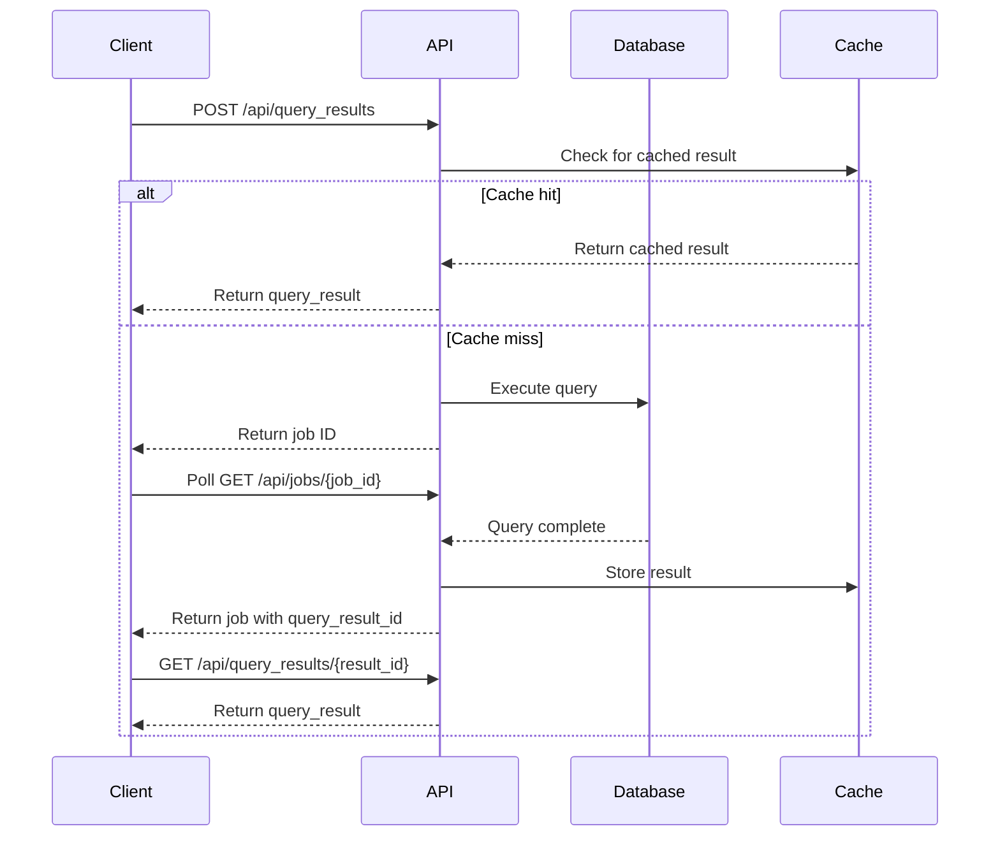

## Execute Query

Execute a query and retrieve results (or return cached results if available).

```bash
POST /api/query_results
```

### Request Body

<ParamField body="query" type="string" required>
  Query text to execute
</ParamField>

<ParamField body="data_source_id" type="number" required>
  ID of the data source to execute the query on
</ParamField>

<ParamField body="max_age" type="number" default="-1">
  Maximum age (in seconds) of cached results to return. Set to `0` to always execute. Set to `-1` to return any cached result.
</ParamField>

<ParamField body="query_id" type="number">
  Query ID to associate with the execution (optional, defaults to "adhoc")
</ParamField>

<ParamField body="parameters" type="object">
  Parameter values for parameterized queries
</ParamField>

<ParamField body="apply_auto_limit" type="boolean" default="false">
  Whether to apply automatic row limit to the query
</ParamField>

### Example Request

```bash
curl -X POST \
  -H "Authorization: Key YOUR_API_KEY" \
  -H "Content-Type: application/json" \
  -d '{
    "query": "SELECT * FROM users WHERE created_at > '{{date}}'",
    "data_source_id": 1,
    "max_age": 0,
    "parameters": {
      "date": "2024-01-01"
    }
  }' \
  https://redash.example.com/api/query_results
```

### Response (Query Executing)

```json
{
  "job": {
    "id": "job_abc123",
    "status": 1,
    "query_result_id": null,
    "error": "",
    "updated_at": 1705765200
  }
}
```

### Response (Cached Result)

```json
{
  "query_result": {
    "id": 456,
    "query_hash": "abc123...",
    "query": "SELECT * FROM users WHERE created_at > '2024-01-01'",
    "data": {
      "columns": [
        {"name": "id", "type": "integer", "friendly_name": "id"},
        {"name": "email", "type": "string", "friendly_name": "email"},
        {"name": "created_at", "type": "datetime", "friendly_name": "created_at"}
      ],
      "rows": [
        {"id": 1, "email": "user@example.com", "created_at": "2024-01-15T10:30:00Z"},
        {"id": 2, "email": "admin@example.com", "created_at": "2024-01-16T14:22:00Z"}
      ]
    },
    "data_source_id": 1,
    "runtime": 1.234,
    "retrieved_at": "2024-01-20T15:00:00Z"
  }
}
```

## Execute Saved Query

Execute a saved query with parameters.

```bash
POST /api/queries/<query_id>/results
```

### Request Body

<ParamField body="parameters" type="object">
  Parameter values for the query
</ParamField>

<ParamField body="max_age" type="number" default="-1">
  Maximum age (in seconds) of cached results to return
</ParamField>

<ParamField body="apply_auto_limit" type="boolean">
  Override query's auto-limit setting
</ParamField>

### Example Request

```bash
curl -X POST \
  -H "Authorization: Key YOUR_API_KEY" \
  -H "Content-Type: application/json" \
  -d '{
    "parameters": {
      "date": "2024-01-01",
      "limit": 100
    },
    "max_age": 3600
  }' \
  https://redash.example.com/api/queries/123/results
```

### Response

Same as Execute Query endpoint.

<Note>
  Query API keys can be used for this endpoint only if the query has no unsafe parameters.
</Note>

## Get Query Result

Retrieve a specific query result by ID.

```bash
GET /api/query_results/<query_result_id>
```

### Example Request

```bash
curl -H "Authorization: Key YOUR_API_KEY" \
  https://redash.example.com/api/query_results/456
```

### Response

```json
{
  "query_result": {
    "id": 456,
    "query_hash": "abc123...",
    "query": "SELECT * FROM users",
    "data": {
      "columns": [...],
      "rows": [...]
    },
    "data_source_id": 1,
    "runtime": 1.234,
    "retrieved_at": "2024-01-20T15:00:00Z"
  }
}
```

## Get Latest Query Result

Get the latest query result for a saved query.

```bash
GET /api/queries/<query_id>/results
```

### Example Request

```bash
curl -H "Authorization: Key YOUR_API_KEY" \
  https://redash.example.com/api/queries/123/results
```

## Download Query Results

Download query results in different formats.

### JSON Format

```bash
GET /api/queries/<query_id>/results.<format>
```

### Supported Formats

- `json` - JSON format (default)
- `csv` - Comma-separated values
- `tsv` - Tab-separated values
- `xlsx` - Excel spreadsheet

### Example Requests

```bash
# CSV format
curl -H "Authorization: Key YOUR_API_KEY" \
  https://redash.example.com/api/queries/123/results.csv

# Excel format
curl -H "Authorization: Key YOUR_API_KEY" \
  -o results.xlsx \
  https://redash.example.com/api/queries/123/results.xlsx
```

### Response Headers

```
Content-Type: text/csv; charset=UTF-8
Content-Disposition: attachment; filename="query_123_2024_01_20.csv"
Cache-Control: private,max-age=31536000
```

## Check Job Status

Check the status of a running query job.

```bash
GET /api/jobs/<job_id>
```

### Example Request

```bash
curl -H "Authorization: Key YOUR_API_KEY" \
  https://redash.example.com/api/jobs/job_abc123
```

### Response

```json
{
  "job": {
    "id": "job_abc123",
    "status": 3,
    "query_result_id": 456,
    "error": "",
    "updated_at": 1705765200
  }
}
```

### Job Status Codes

<ResponseField name="status" type="number">
  Job status code:
  - `1` - Pending
  - `2` - Started
  - `3` - Success
  - `4` - Failure
  - `5` - Cancelled
</ResponseField>

## Cancel Job

Cancel a running query job.

```bash
DELETE /api/jobs/<job_id>
```

### Example Request

```bash
curl -X DELETE \
  -H "Authorization: Key YOUR_API_KEY" \
  https://redash.example.com/api/jobs/job_abc123
```

## Query Dropdown Values

Get dropdown values for a query-based parameter.

```bash
GET /api/queries/<query_id>/dropdown
```

### Example Request

```bash
curl -H "Authorization: Key YOUR_API_KEY" \
  https://redash.example.com/api/queries/123/dropdown
```

### Response

```json
[
  {"value": 1, "name": "Option 1"},
  {"value": 2, "name": "Option 2"},
  {"value": 3, "name": "Option 3"}
]
```

<Note>
  The query must return columns named `value` and `name` (or just `name`, which will be used for both).
</Note>

## Query Execution Flow

Here's the typical flow for executing a query and retrieving results:



## Error Responses

### Missing Data Source

```json
{
  "job": {
    "status": 4,
    "error": "Please select data source to run this query."
  }
}
```

### No Permission

```json
{
  "job": {
    "status": 4,
    "error": "You do not have permission to run queries with this data source."
  }
}
```

### Data Source Paused

```json
{
  "job": {
    "status": 4,
    "error": "PostgreSQL Database is paused (Maintenance). Please try later."
  }
}
```

### Missing Parameters

```json
{
  "job": {
    "status": 4,
    "error": "Missing parameter value for: date, user_id"
  }
}
```

### Unsafe Parameters (Query API Key)

```json
{
  "job": {
    "status": 4,
    "error": "This query contains potentially unsafe parameters and cannot be executed on a shared dashboard or an embedded visualization."
  }
}
```

## Best Practices

<AccordionGroup>
  <Accordion title="Use Caching Appropriately">
    Set `max_age` based on your data freshness requirements:
    - Use `0` for real-time data
    - Use `3600` (1 hour) for data that updates hourly
    - Use `-1` to always return cached results when available
  </Accordion>

  <Accordion title="Poll Job Status Efficiently">
    When executing long-running queries:
    - Start with 1-second poll intervals
    - Use exponential backoff up to 5-10 seconds
    - Set a maximum timeout based on expected query runtime
  </Accordion>

  <Accordion title="Handle Parameters Safely">
    - Validate parameter values before sending
    - Use typed parameters (date, number, etc.) when possible
    - Be aware of safe vs. unsafe parameters for query API keys
  </Accordion>

  <Accordion title="Download Large Results">
    For large result sets:
    - Use CSV or TSV format instead of JSON
    - Consider pagination or filtering at the query level
    - Cache results when appropriate
  </Accordion>
</AccordionGroup>