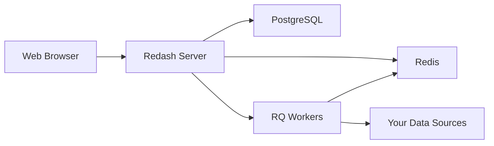

Redash is designed to enable anyone, regardless of the level of technical sophistication, to harness the power of data big and small. SQL users leverage Redash to explore, query, visualize, and share data from any data sources. Their work in turn enables anybody in their organization to use the data. 

Every day, millions of users at thousands of organizations around the world use Redash to develop insights and make data-driven decisions.

## What is Redash?

Redash is a browser-based data visualization and collaboration platform that connects to your databases and data sources, allowing you to query, visualize, and share your data. It bridges the gap between data analysts and business stakeholders by making data exploration accessible without requiring deep technical knowledge.

## Key Features

<CardGroup cols={2}>
  <Card title="Browser-Based Interface" icon="browser">
    Everything runs in your browser with shareable URLs. No software installation required for end users.
  </Card>
  
  <Card title="Powerful Query Editor" icon="code">
    Compose SQL and NoSQL queries with schema browser, auto-complete, and syntax highlighting.
  </Card>
  
  <Card title="Rich Visualizations" icon="chart-line">
    Create beautiful visualizations with drag-and-drop tools and combine them into interactive dashboards.
  </Card>
  
  <Card title="Collaboration & Sharing" icon="users">
    Share visualizations and queries with your team, enabling peer review and knowledge sharing.
  </Card>
  
  <Card title="Scheduled Refreshes" icon="clock">
    Automatically update your charts and dashboards at intervals you define.
  </Card>
  
  <Card title="Smart Alerts" icon="bell">
    Define conditions and get instant notifications when your data changes.
  </Card>
  
  <Card title="REST API" icon="api">
    Everything available in the UI is also accessible through a comprehensive REST API.
  </Card>
  
  <Card title="35+ Data Sources" icon="database">
    Native support for SQL, NoSQL, cloud platforms, and custom data sources.
  </Card>
</CardGroup>

## Who Uses Redash?

### Data Analysts & Engineers

Data professionals use Redash to:
- Write and test SQL queries with an intuitive editor
- Explore database schemas and relationships
- Create reusable query snippets
- Schedule automated data refreshes
- Build comprehensive dashboards

### Business Stakeholders

Non-technical users benefit from:
- Pre-built dashboards with real-time data
- Interactive visualizations without writing code
- Parameter-based queries for custom filtering
- Email alerts on critical metrics
- Shared organizational knowledge base

### Engineering Teams

Development teams leverage Redash for:
- Application performance monitoring
- User behavior analytics
- System health dashboards
- API integration via REST endpoints
- Embedded visualizations in internal tools

## Supported Data Sources

Redash provides native support for over 35 data sources, including:

<AccordionGroup>
  <Accordion title="Cloud Data Warehouses">
    - Amazon Athena
    - Amazon Redshift
    - Google BigQuery
    - Snowflake
    - Databricks
    - Azure Synapse
  </Accordion>
  
  <Accordion title="SQL Databases">
    - PostgreSQL
    - MySQL / MariaDB
    - Microsoft SQL Server
    - Oracle
    - SQLite
    - CockroachDB
  </Accordion>
  
  <Accordion title="NoSQL Databases">
    - MongoDB
    - Elasticsearch
    - Cassandra
    - DynamoDB
    - Couchbase
    - ArangoDB
  </Accordion>
  
  <Accordion title="Analytics & Metrics">
    - Google Analytics
    - Prometheus
    - Graphite
    - InfluxDB
    - Datadog
    - CloudWatch
  </Accordion>
  
  <Accordion title="SaaS & APIs">
    - Salesforce
    - JIRA (JQL)
    - Google Spreadsheets
    - JSON/CSV files
    - Custom URLs
    - Shell Scripts
  </Accordion>
</AccordionGroup>

<Note>
Redash's extensible data source API allows you to add support for additional databases and platforms.
</Note>

## Core Capabilities

### Query Creation & Management

Redash's query editor provides:
- **Schema browser** with searchable database objects
- **Auto-completion** for table and column names
- **Query snippets** for reusable SQL fragments
- **Query parameters** for dynamic filtering
- **Version history** to track changes
- **Fork functionality** to create query variants

### Visualization Types

Create compelling data stories with:
- Charts (line, bar, area, pie, scatter, bubble)
- Tables with conditional formatting
- Counters and trend indicators
- Maps (choropleth, markers, heatmaps)
- Pivot tables
- Funnel analysis
- Cohort grids
- Sankey diagrams
- Word clouds
- Custom visualizations with JavaScript

### Dashboards

Combine multiple visualizations into unified dashboards:
- Drag-and-drop layout editor
- Text boxes for annotations and context
- Dashboard-level parameters
- Auto-refresh capabilities
- Full-screen presentation mode
- Public sharing with access tokens

### Alerts & Notifications

Stay informed with intelligent alerting:
- Define threshold-based conditions
- Schedule regular checks
- Multiple notification destinations (email, Slack, webhooks, etc.)
- Alert state tracking
- Custom rearm intervals

## Architecture Overview

Redash consists of several components that work together:

- **Server**: Flask-based web application serving the UI and API
- **PostgreSQL**: Stores Redash metadata (queries, dashboards, users)
- **Redis**: Message queue and caching layer
- **Workers**: Background job processors for query execution
- **Scheduler**: Manages scheduled queries and alerts

## Security & Deployment

Redash provides enterprise-ready features:
- Multi-organization support
- Role-based access control (RBAC)
- SSO integration (Google OAuth, SAML, LDAP)
- Query result access controls
- API key management
- Data source credential encryption
- HTTPS enforcement
- CSRF protection

## Open Source & Community

Redash is open source software released under the BSD-2-Clause license:
- [Source code on GitHub](https://github.com/getredash/redash)
- [Community discussions](https://github.com/getredash/redash/discussions)
- [Discord server](https://discord.gg/tN5MdmfGBp) for development discussions
- Regular stable releases every 3-4 months

<Note>
  Security vulnerabilities should be reported to security@redash.io rather than public issue trackers.
</Note>

## Next Steps

<CardGroup cols={2}>
  <Card title="Quickstart Guide" icon="rocket" href="/quickstart">
    Get Redash running in minutes and create your first visualization
  </Card>
  
  <Card title="Installation Guide" icon="server" href="/installation">
    Deploy Redash in production with Docker and docker-compose
  </Card>
</CardGroup>